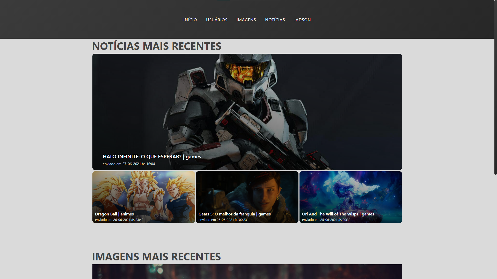
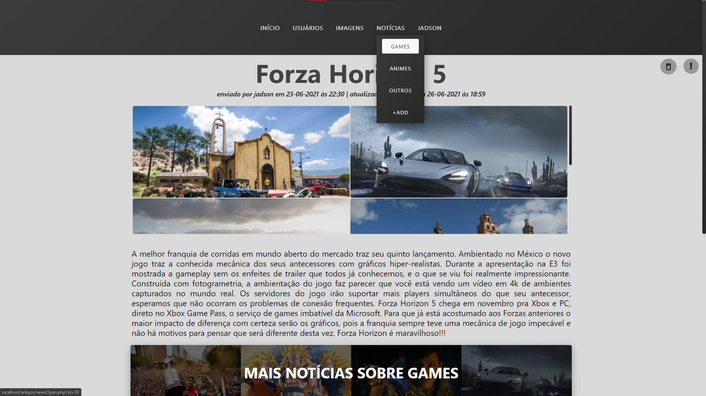
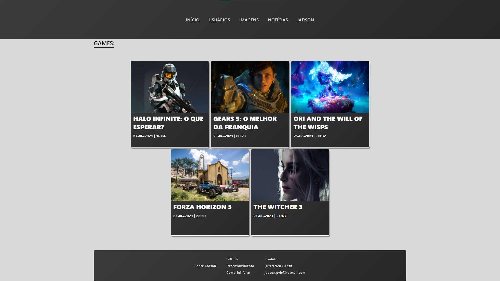
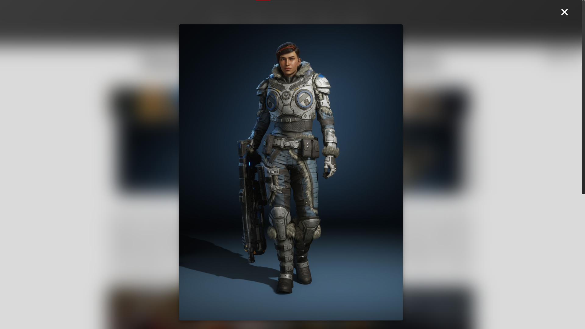
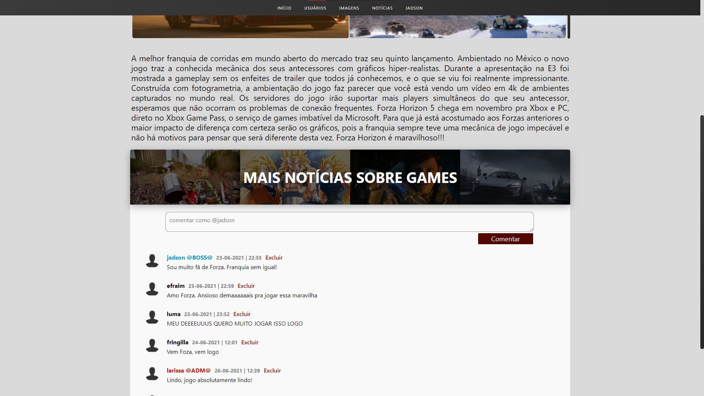
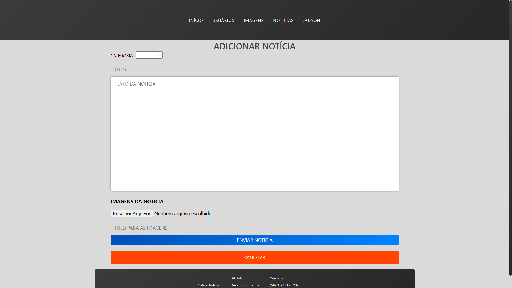
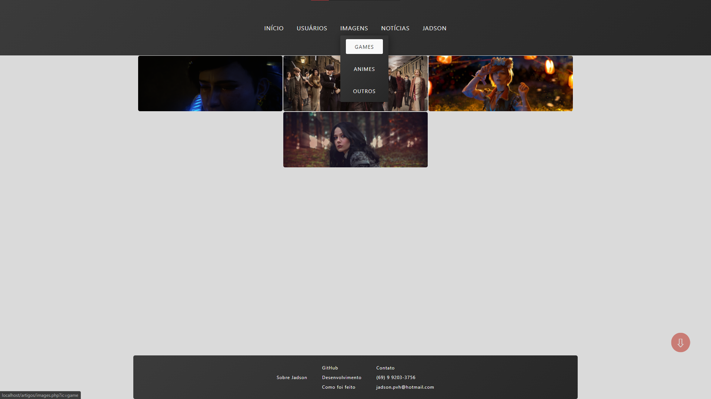
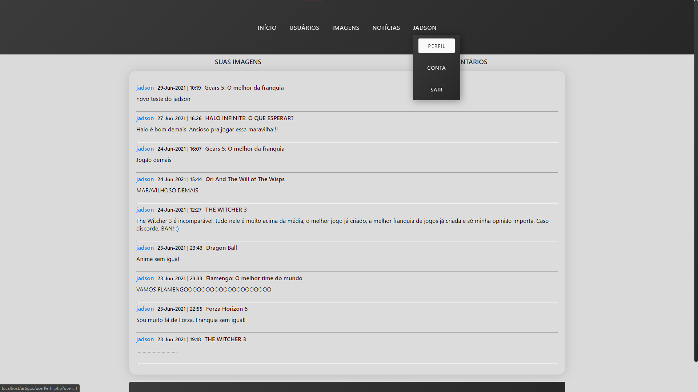
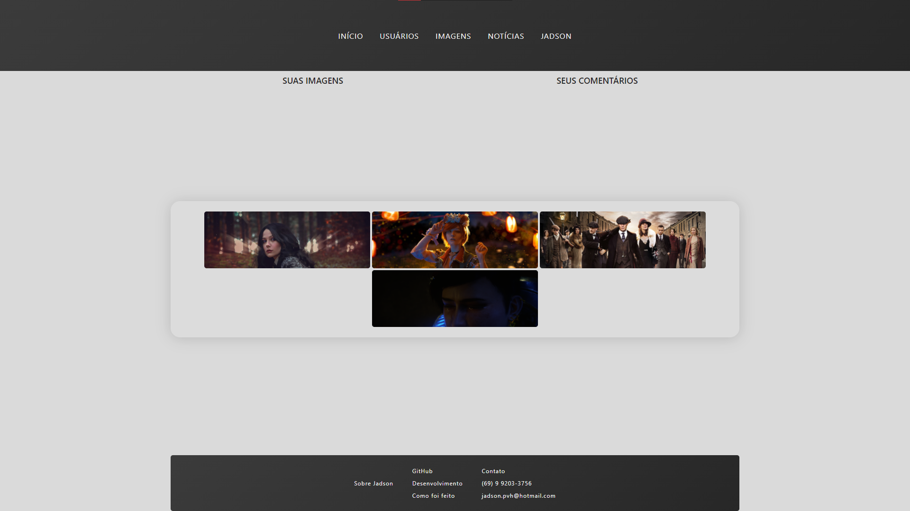
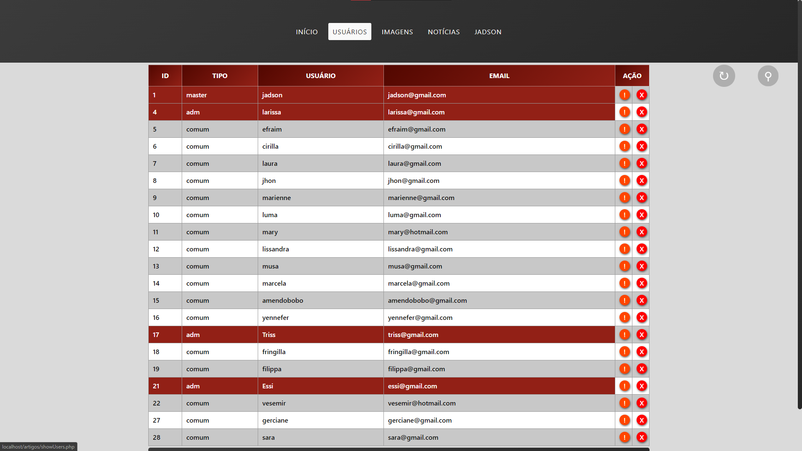

## como rodar: 
- criar o banco de dados localizado na pasta Database 
- abrir o projeto na pasta htdocs
- login master: jadson@gmail.com senha: jadson

# INTERFACE
## TELA INICIAL DO SITE
- menu superior muda de acordo com o tipo de usuário logado, MASTER e ADM tem acesso à opção USUÁRIOS (mostrar os usuários) e +ADD (adicionar notícia)
- exibe (com redirecionamento) as últimas 4 notícias enviadas
- mais abaixo exibe as últimas 5 imagens enviadas que não tenham relação com notícias

## TELA COM NOTÍCIA ABERTA
- ao abrir uma notícia são exibidas também as imagens relacionadas à ela
- ADM e MASTER podem excluir as imagens da notícia passando o mouse no canto superior de cada uma e clicando no 'x' que é exibido
- selecionar uma categoria de notícia no menu superior sempre abre a última notícia da categoria, clicar em "MAIS NOTÍCIAS SOBRE (CATEGORIA)" exibe a página com todas as notícias da categoria selecionada
- o ADM que enviou a notícia pode excluí-la, qualquer ADM pode atualizar qualquer notícia. O MASTER pode editar ou excluir qualquer notícia.

## PÁGINA COM TODAS AS NOTÍCIAS DE UMA CATEGORIA
- ao clicar em "MAIS NOTÍCIAS SOBRE GAMES" esta é a página exibida

## MODAL COM IMAGEM ABERTA
- ao clicar em uma imagem ela é aberta neste modal sobre a página atual

## SESSÃO DE COMENTÁRIOS NA NOTÍCIA
- cada notícia traz uma sessão de comentários
- o formulário para comentar só aparece caso o usuário esteja logado, um pedido de login é mostrado em caso contrário
- o nome do MASTER fica destacado em azul e os ADM ficam em vermelho

## PÁGINA PARA ADICIONAR NOTÍCIA
- página de upload das notícias
- o envio da notícia e das imagens atreladas a ela é feito com apenas um formulário, podem ser enviadas várias imagens para cada notícia

## PÁGINA QUE EXIBE TODAS AS IMAGENS POR CATEGORIA
- o botão de upload só fica visível caso o usuário esteja logado
- ADM e MASTER também podem excluir qualquer imagem desta página, bastando mover o mouse no canto superior direito de cada uma e clicar no 'x' que é exibido

## PÁGINA DO USUÁRIO QUE EXIBE TODAS AS IMAGENS E COMENTÁRIOS ENVIADOS POR ELE
- somente o próprio usuário tem acesso à esta página
- cada comentário traz o título da respectiva notícia (com redirecionamento) ao lado da data

- nesta página o usuário pode excluir suas imagens ao mover o mouse sobre ela e clicar no 'x' que é exibido

## TABELA COM TODOS OS USUÁRIOS 
- só é exibida para ADM e MASTER
- tem opção de busca por tipo de usuário, nome de usuário e email

# SISTEMA DE CADASTRO
- verifica se o nome de usuário já existe (tanto no cadastro como na hora de atualizar os dados)
- verifica se o email já existe
- converte a senha em password_hash
# SISTEMA DE LOGIN
- compara a senha inserida com o hash do banco de dados

# NÍVEIS DE ACESSO
### MASTER: 
#### O que o MASTER pode:
- pode editar os dados (nome, senha, tipo) de qualquer usuário
- pode transformar um usuário comum em ADM e vice-versa
- pode excluir qualquer usuário
- pode editar qualquer notícia
- pode excluir qualquer notícia, incluindo aquelas que ele não postou
- pode excluir qualquer imagem
- pode excluir qualquer comentário

#### O que o MASTER não pode:
- não pode excluir a própria conta

### ADM: 
#### O que o ADM pode:
- pode editar os dados (nome, senha) de qualquer usuário de nível comum
- pode excluir qualquer usuário de nível comum
- pode editar qualquer notícia
- pode excluir apenas as notícias que ele enviou
- pode excluir qualquer comentário (exceto os comentários do MASTER)
#### O que o ADM não pode:
- não pode excluir a própria conta
- não pode editar ou excluir outros ADM 
- não pode editar ou excluir o MASTER

### COMUM:
#### O que pode:
- pode enviar imagens
- pode comentar nas notícias
- pode editar seus dados (nome de usuário, senha)
- pode excluir as próprias imagens
- pode excluir os próprios comentários
- pode excluir sua conta
#### O que não pode:
- não pode excluir imagens de outros usuários
- não pode excluir comentários de outros usuários
- não pode editar os dados de outros usuários
- não pode excluir outros usuários

# SEGURANÇA
- para excluir notícias e usuários o ADM ou MASTER devem confirmar sua senha
- modais de upload só aparecem caso o usuário esteja logado
- todos os inputs com addslashes e htmlentities